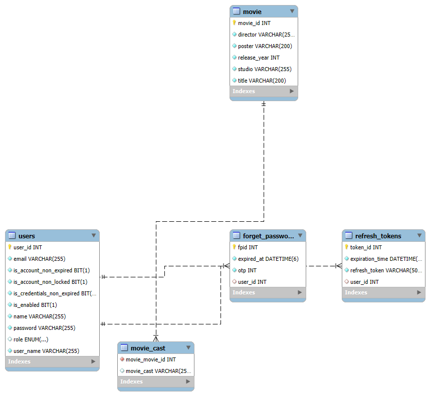

# 🎬 **Movie API – Secure Backend System**


## 📌 **Description**
A secure, production-ready REST API built with Spring Boot for managing movies with authentication, file handling, pagination, and robust error handling.  
This API demonstrates real-world backend concepts, perfect for portfolios and real applications.

---

## 🚀 **Tech Stack**
| Layer | Technology |
|-------|------------|
| Language | Java 17 |
| Framework | Spring Boot |
| Security | Spring Security + JWT |
| Database | MySQL |
| Build Tool | Maven |
| Tools | Postman, Lombok |

---

## ✅ **Features**
✔ User registration & login (JWT secured)  
✔ Forgot & Reset password via email token  
✔ Movie CRUD operations  
✔ Pagination & Sorting  
✔ File upload/download  
✔ Custom Exception Handling  
✔ Validation  
✔ Secure endpoints with role-based access

---

## 🗺️ **API Documentation**
> Use Postman / Swagger to explore all endpoints  
> Secured endpoints require:

---
## 🗄️ ER Diagram

<h3 align="center">Database Schema</h3>

<p align="center">
  
</p>

--- 
## 📂 Project Structure

```
src/
├── main/
│   ├── java/
│   │   └── com/movieapp/
│   │       ├── auth/           # Authentication & Security logic
│   │       ├── controller/     # REST Controllers
│   │       ├── service/        # Business logic layer
│   │       ├── repository/     # Data access layer (JPA)
│   │       └── model/          # Entities
│   │
│   └── resources/
│       ├── application.properties
│       └── static/
│
└── test/
```

## 🚀 Installation & Run

### 1️⃣ Clone the Repository

```bash
git clone https://github.com/Beda202/secure-movie-api-springboot.git
cd secure-movie-api-springboot
```

### 2️⃣ Configure Application

Update the following file with your database credentials:

```
src/main/resources/application.properties
```

Example:

```properties
spring.datasource.url=jdbc:mysql://localhost:3306/movie_db
spring.datasource.username=root
spring.datasource.password=Root123@#$
```

### 3️⃣ Build & Run the Application

```bash
mvn clean install
mvn spring-boot:run
```

Application will start at:

```
http://localhost:8080
```
